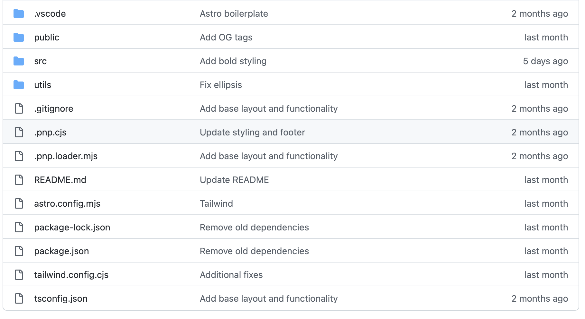
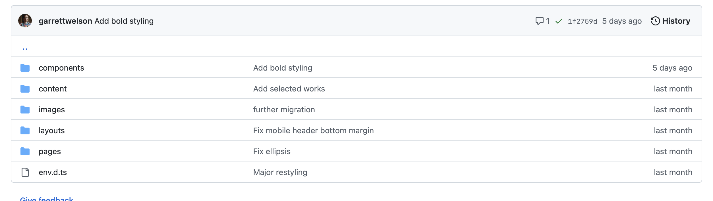

# tl;dr 

Personal site for author Christopher Zombik

# Content Updating Workflow

1. Download [Github Desktop](https://desktop.github.com/download/) and "clone" the `chriszombik` repo into a folder on your machine (it can go wherever, typically I choose the home directory or `Documents`)
2. Update any of the files in the `/src/content` folder or add new blog post files by copying an existing file and adding new content
3. In **Github Desktop**, create a new branch with any arbitrary name. Select the files you have changed/added/deleted and "commit" them to this new branch
4. Select the option to "push" the branch you just created to "origin" (which is just github.com)
5. Go to [the chriszombik repo on github.com](https://github.com/garrettwelson/chriszombik) and you should see a banner saying your branch name has recent commits and inviting you to open a "pull request"
6. Click "compare and pull request" and go into the pull request (PR) that is created
7. After about a minute, you'll see an automatically generated comment on the PR from `vercel` with a link to preview your changes
8. Make sure the changes look as you expect
9. When satisifed, click the `merge` button at the bottom of the pull request. It will be merged into the `main` branch and the new site will deploy

# Site Owner's Manual

## Frontend

The site's frontend is built with a framework called [Astro](https://astro.build). Astro is what people would typically call a `Static Site Generator`, which is a tool that runs _once_ against a directory of content (think Markdown, images, CSS files, HTML, etc.) and generates a **static** folder of HTML content that people then see when they go to your website. If the folder has a file at the route `/blog/post-name.md`, the corresponding URL for that post would be `chriszombik.com/blog/post-name` - you can almost think of it like the user is browsing a file directory in Finder through your website. Astro does this by following a set of rules and templates that are configured by me, applying different templates to different content.

### Astro's File System
The files are laid out according to this rough structure. In general, you shouldn't need to concern yourself with any of this, but note that `src/` is where the "source" files are all stored, and is where edits will most frequently be made. Anything in `public/` is just copied over into the built version of your site with no changes. So, if I put a PDF in there called `ChrisZombikResume.pdf` and someone went to `chriszombik.com/ChrisZombikResume.pdf` , they'd see the PDF. Similarly, if the file were in say `public/files/resume/ChrisZombik.pdf`, you'd go to `chriszombik.com/files/resume/ChrisZombik.pdf` to access it.

### Understanding the src/ folder

- `components` contains various "components", which can be thought of as snippets of HTML/content. These allow for repeatable functionality. For instance, `recent-posts.astro` ([link here](https://github.com/garrettwelson/chriszombik/blob/main/src/components/RecentPosts.astro)) displays a bulleted list of the most recent blog posts. It is used on the homepage, but it may be used elsewhere in the future so it makes sense to encapsulate as a component
- `content` is where static text (e.g. Markdown) representing blog posts, recent works, etc. lives. Astro is aware that the text here forms "collections" which can be queried and populated into templates. There is one template for all blog posts, for instance, and the title, date, text, etc. are all slotted in. 
- `images` contains images used on the site
- `layouts` contains the `BaseLayout.astro` ([link here](https://github.com/garrettwelson/chriszombik/blob/main/src/layouts/BaseLayout.astro)), which forms the structure of every page. You can see that it applies common elements like the `<Header />` and `<Footer />` which we want to render on every page
- `pages` contains each page (or route) in the site. If we made `foo.astro` inside the `pages` folder, going to `chriszombik.com/foo` would load up whatever content we included in that file. An easy example to see is the `about` page ([link here](https://github.com/garrettwelson/chriszombik/blob/main/src/pages/about.astro))

### Styling

The site's styling is done using [Tailwind.css](https://tailwindcss.com), which is an extremely popular framework that provides "utility classes" for CSS. You'll notice that there are no CSS files I've defined in the project. Everything comes from Tailwind, and basically each style I wish to apply gets its own class. This is a controversial approach, but for single-developer projects like this it makes a lot of sense, and Tailwind is a widely used tool with rich support that will be around for a long time.

## Source Control

The site's source code is stored on GitHub in [this repository (aka "repo")](https://github.com/garrettwelson/chriszombik) - a repo is just like a folder of stuff that Git knows about, it is the "top level" folder of the project. The repo is public, meaning anyone can see it on my GitHub account. That said, it is protected from random people making edits/changes to it.

## Hosting

The GitHub repo is connected to a hosting provider called [Vercel](https://vercel.com/dashboard) - Vercel is very much the "hot" provider for this sort of thing among frontend developers, and while they have lots of powerful enterprise features where they make money, their core features for hobbyist sites and small projects are free, which has made them so popular among developers (who then get their companies to pay for the fancy enterprise stuff). Using Vercel's tooling, it is connected to the GitHub repo. Whenever anyone makes changes to the `main` branch in GitHub (this is what we'd think of as the canonical/production version of the site, as opposed to any number of "feature" branches where I build new things), Vercel will be alerted to the change, pull in that new version from `main`, build the static folder of HTML pages, and then make it available at the domain.

## Domain Name

The site's domain name is registered on [Hover](https://www.hover.com).

